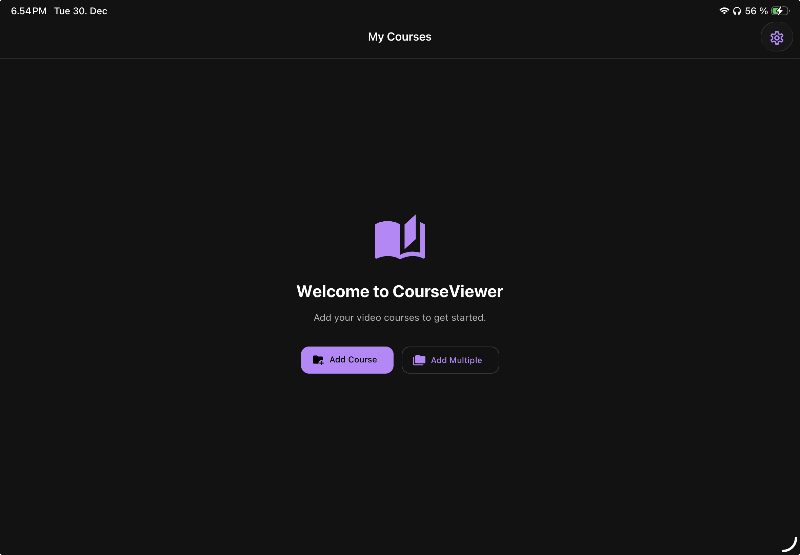
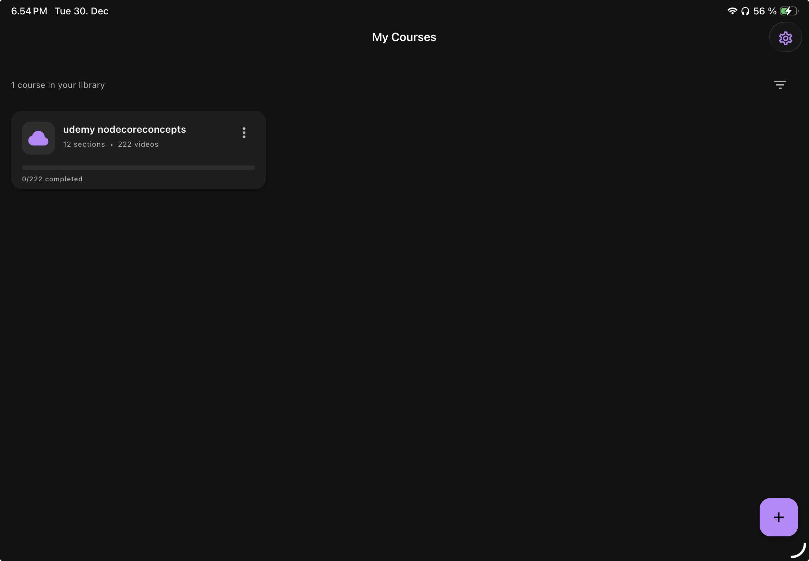
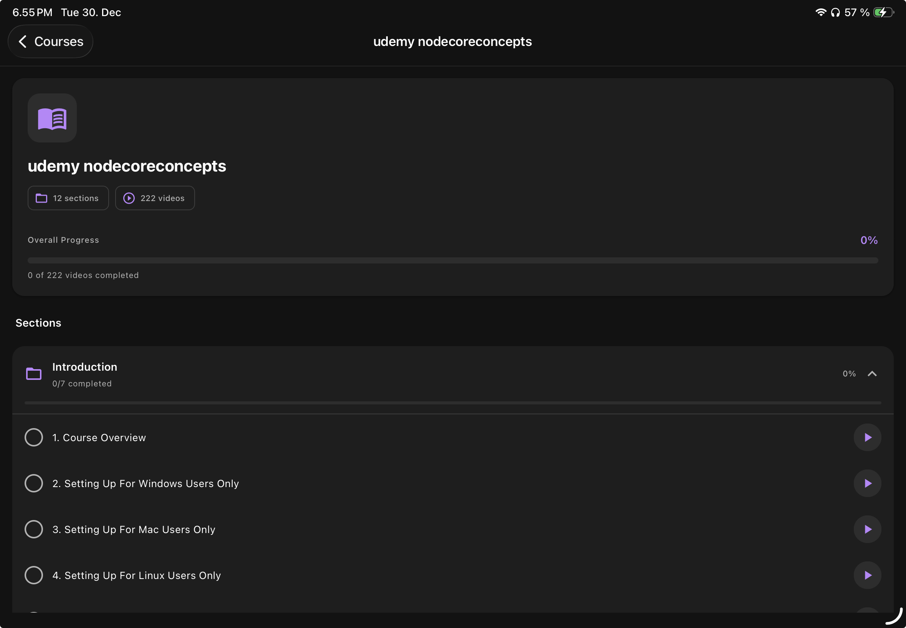
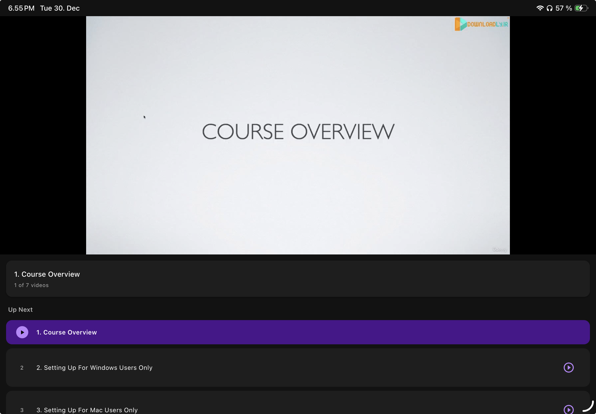
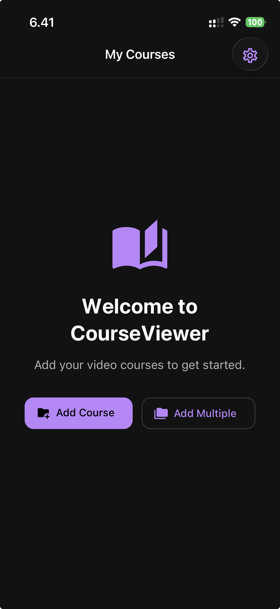
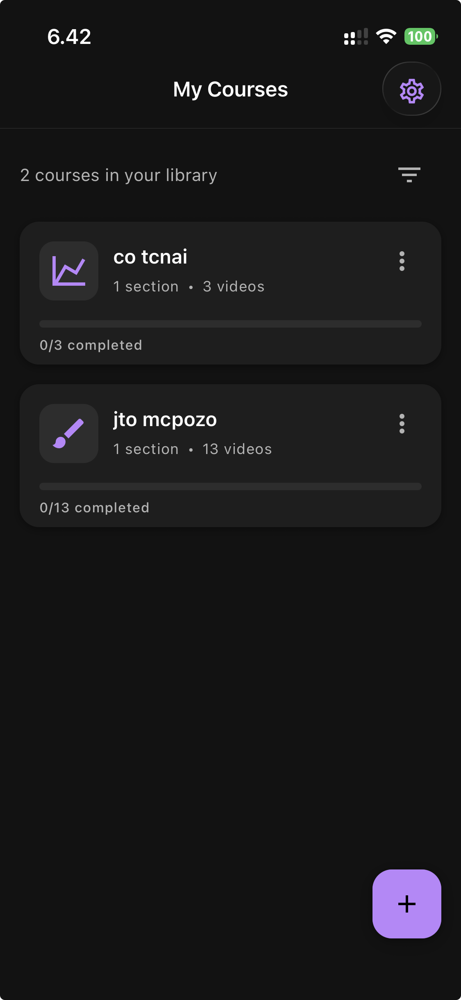
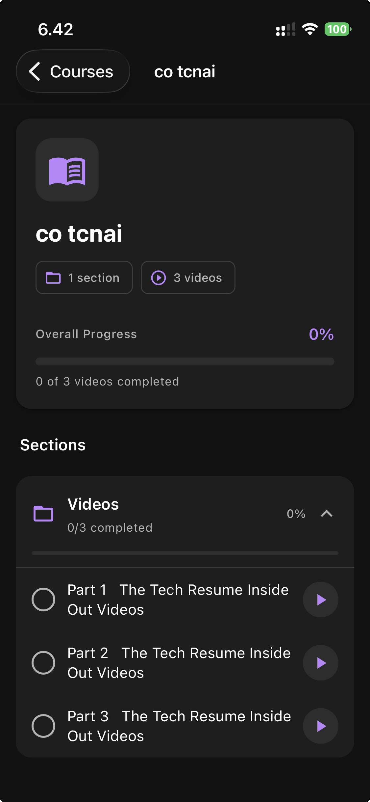
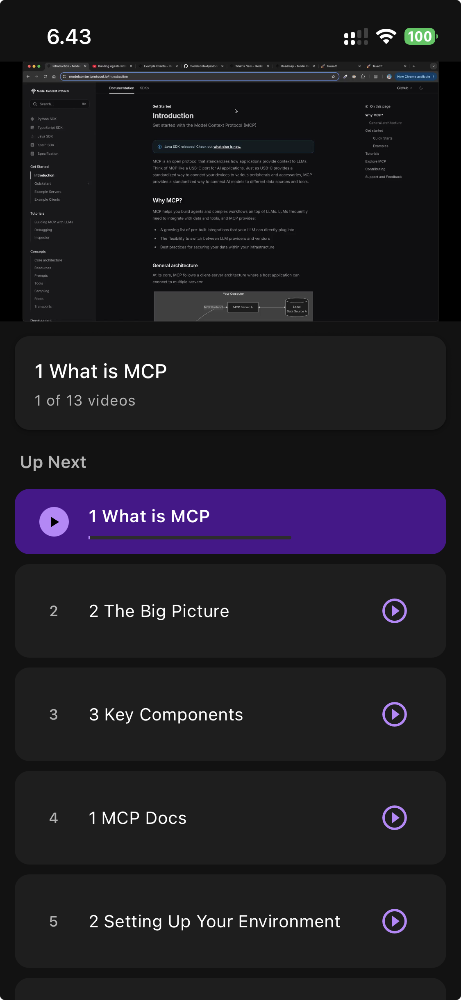

# CourseViewer

A local video course player for iOS and iPad. Import courses from your device, track progress, and pick up where you left off.

## Screenshots

### iPad

<p align="center">
  
  
</p>
<p align="center">
  
  
</p>

### iPhone

<p align="center">
  
  
  
  
  
</p>

## Features

- Import video courses from local folders
- Automatic progress tracking per video
- Resume playback from where you left off
- Auto-play next video with countdown
- Playback speed control (0.5x - 2x)
- Fullscreen landscape mode
- Section-based course organization
- Works offline

## Build for iOS

### Prerequisites

- macOS
- Node.js 18+
- Xcode 15+ (install from App Store)
- Apple Developer account (free or paid)

### 1. Clone and Install

```bash
git clone https://github.com/yourusername/CourseViewer.git
cd CourseViewer
npm install
```

### 2. Install iOS Dependencies

```bash
npx pod-install
```

### 3. Run in Simulator

```bash
npm run ios
```

This opens the app in the iOS Simulator.

### 4. Build for Physical Device

1. Open `ios/CourseViewer.xcworkspace` in Xcode
2. Select your connected iPhone/iPad as the target device
3. Go to **Signing & Capabilities**
4. Select your Team (Apple Developer account)
5. Click the Play button to build and run

> Note: First build requires trusting the developer certificate on your device. Go to **Settings > General > VPN & Device Management** and trust your developer certificate.

### 5. TestFlight Distribution (Optional)

To share with others via TestFlight:

1. In Xcode, select **Product > Archive**
2. Once archived, click **Distribute App**
3. Select **App Store Connect** > **Upload**
4. Log into App Store Connect
5. Go to **TestFlight** and add testers by email

## Tech Stack

- React Native / Expo
- expo-video
- expo-file-system
- react-native-paper (Material Design 3)
- AsyncStorage for persistence
