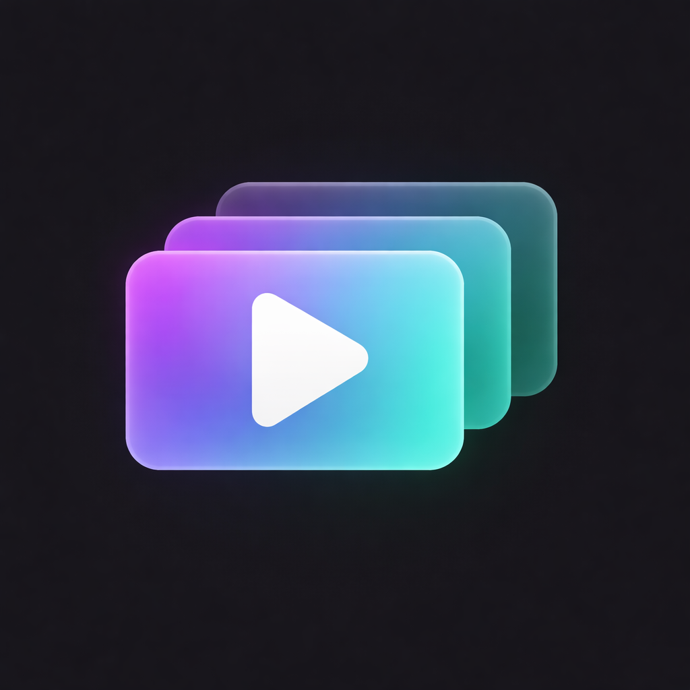

<p align="center">
  
</p>

<h1 align="center">CourseViewer</h1>

<p align="center">
  A local video course player for iOS and iPad.<br/>
  Import courses from your device, track progress, and pick up where you left off.
</p>

<p align="center">
  
  
  
  
</p>

---

## Screenshots

### iPhone

<p align="center">
  
  &nbsp;
  
  &nbsp;
  
  &nbsp;
  
  &nbsp;
  
</p>

### iPad

<p align="center">
  
  &nbsp;&nbsp;
  
</p>
<p align="center">
  
  &nbsp;&nbsp;
  
</p>

---

## Features

- Import video courses from local folders
- Automatic progress tracking per video
- Resume playback from where you left off
- Auto-play next video with countdown
- Playback speed control (0.5x - 2x)
- Fullscreen landscape mode
- Section-based course organization
- Works completely offline

---

## Build for iOS

### Prerequisites

- macOS
- Node.js 18+
- Xcode 15+ (from App Store)
- Apple Developer account (free or paid)

### 1. Clone and Install

```bash
git clone https://github.com/yourusername/CourseViewer.git
cd CourseViewer
npm install
```

### 2. Install iOS Dependencies

```bash
npx pod-install
```

### 3. Run in Simulator

```bash
npm run ios
```

### 4. Build for Physical Device

1. Open `ios/CourseViewer.xcworkspace` in Xcode
2. Select your connected iPhone/iPad as the target
3. Go to **Signing & Capabilities** → Select your Team
4. Click **Play** to build and run

> **Note:** First build requires trusting the developer certificate on your device:
> Settings → General → VPN & Device Management → Trust certificate

---

## Tech Stack

| | |
|---|---|
| **Framework** | React Native / Expo |
| **Video** | expo-video |
| **File System** | expo-file-system |
| **UI** | React Native Paper (Material Design 3) |
| **Storage** | AsyncStorage |

---

<p align="center">
  Made for learning on the go
</p>
